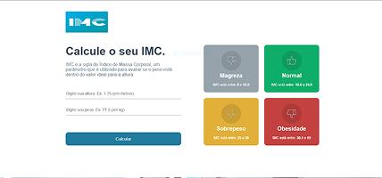

# Calculadora de IMC


Projeto criado durante o curso **[B7web](https://b7web.com.br)**, com o objetivo de desenvolver uma calculadora de IMC que permita ao usuário informar peso e altura e receber, de forma clara e imediata, a classificação do índice de massa corporal.
Utilizando **React** com componentização, **TypeScript** para maior organização do código e **CSS** para estilização da interface. Uma aplicação funcional e responsiva.


<div></div>

## Tecnologias utilizadas

**React** – Biblioteca para criação de interfaces dinâmicas

**TypeScript** – Tipagem estática para código mais seguro e escalável

**CSS** – Estilização rápida e responsiva 

## 🧩 Estrutura do projeto

```
├── public/              # Imagens e ícones
├── src/
│   ├── components/      # Componentes reutilizáveis
│   ├── assets/          # Arquivos que serão importados dentro do código
│   ├── helpers/         # Organizar a lógica e reutilizar código 
│   ├── App.tsx          # Arquivo da página principal
│   └── App.module.css   # Estilização         
└── package.json
```

## ⚙️ Como executar o projeto


#### 1. Clone este repositório:

Copiar código:

``git clone https://github.com/seu-usuario/react_calc_imc.git``


#### 2. Acesse a pasta do projeto:

Copiar código:

``cd react_calc_imc``


#### 3. Instale as dependências:

Copiar código:

``npm install``


#### 4. Execute o servidor de desenvolvimento:

Copiar código:

`npm start`


#### 5. Abra no navegador:

Copiar código:

``http://localhost:3000``


